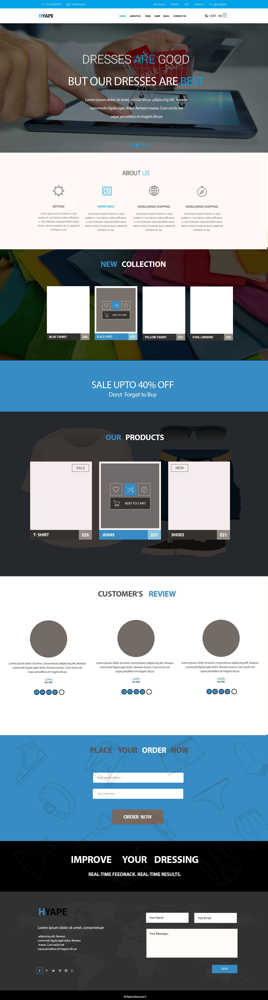

# Psd_html
this is test

# SHOP html template

## use 

Use the node-module live-server

```bash
npm install live-server 
```

### picture of template




## License
[MIT](https://choosealicense.com/licenses/mit/)
